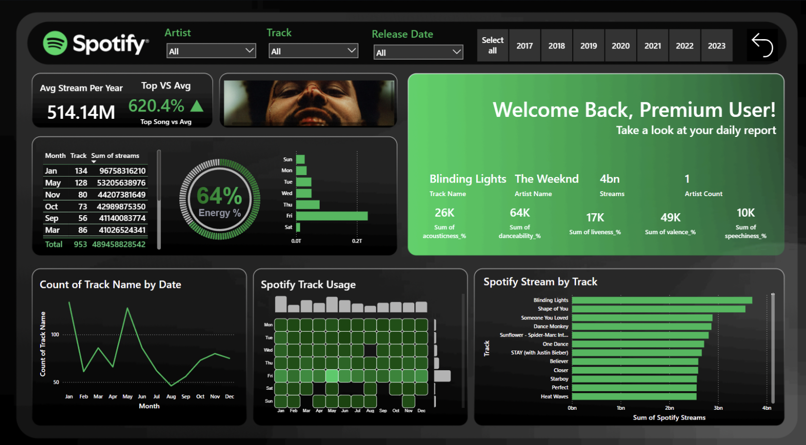

# 🎧 Spotify Streaming Analytics Dashboard 2024 – Power BI Project  

  

## 📄 Overview  
This project delivers an interactive **Spotify Analytics Dashboard** developed using **Power BI** and **Python**. It analyzes 2024 streaming trends to uncover insights about artists, tracks, and listener preferences. With Spotify API integration and Python-generated visuals, the dashboard provides a powerful combination of design and analytics.

---

## 🧰 Technologies Used  
- **Languages:** Python, DAX  
- **Tools & Libraries:** Power BI, Matplotlib, Seaborn, Pandas, NumPy  
- **API:** Spotify for Developers API  
- **Design:** Figma for dashboard layout and theme  

---

## 🗂️ Dataset  
- **Records:** 954 tracks  
- **Columns:** `track_name`, `artist(s)_name`, `released_year`, `streams`, `bpm`, `energy_%`, `danceability_%`, etc.  
- **Source:** Spotify 2024 streaming dataset   
- **Goal:** To explore listening patterns, performance metrics, and feature relationships across tracks and artists.  

---

## 💡 Insights  
- Discover top-performing songs and artists of 2024.  
- Identify audio attributes (energy, danceability, valence) influencing popularity.  
- Explore streaming trends and listener engagement across platforms.  
- Compare artist performance by year, month, and playlist presence.    

---

## 📊 Dashboards  
- **Top Tracks by Stream Count**  
- **Energy & Valence Distribution**  
- **Streams by Day and Month**  
- **Artist Popularity Over Time**  
- **Spotify Track Usage Heatmap (Python Visual)**  
- **Top Features Breakdown (Danceability, Energy, Valence, etc.)**

---

## 🔧 Setup Instructions  
1. Download or connect your Spotify dataset (CSV/API).  
2. Load the data into **Power BI Desktop**.  
3. Create necessary transformations using Power Query.  
4. Integrate album covers and metrics via **Spotify API** using Python scripts.  
5. Publish the dashboard to Power BI Service for interactive exploration.  

---
